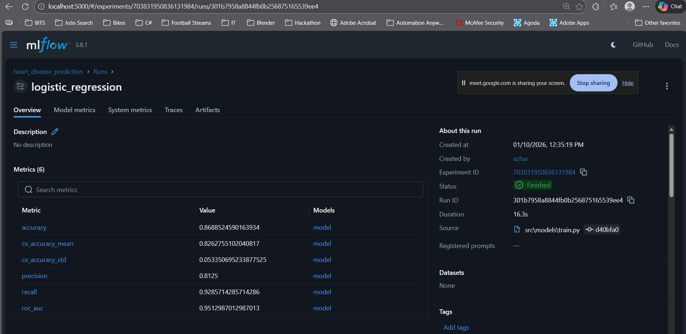
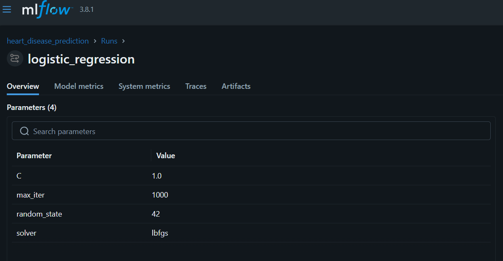
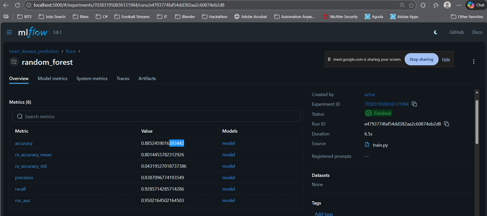
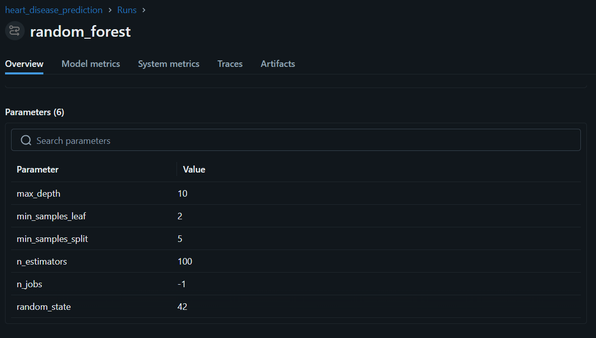
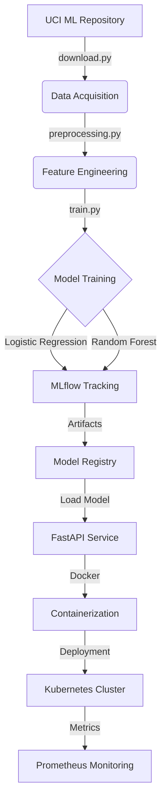
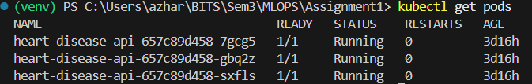
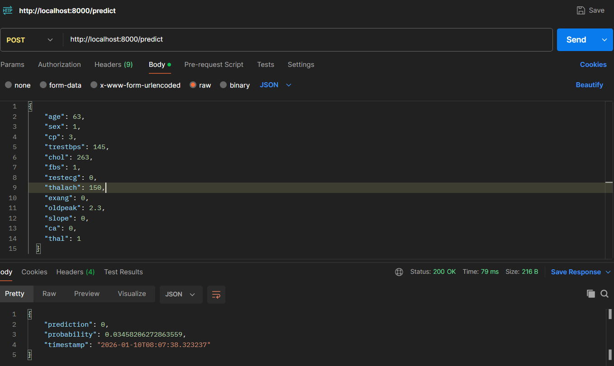

# MLOps Assignment Report
## Heart Disease Prediction - End-to-End ML Pipeline

**Course:** MLOps (S1-25_AIMLCZG523)  
**Assignment:** Assignment I  
**Date:** 2024-10-26

### Students
| Student Name | ID |
|-------------|-------|
| Azhar Nekware | 2024aa05736 |
| Anurag Sharma | 2023AC05271 |
| SHIKHAR DALELA | 2023AC05481 |
| NITIN KUSHWAHA | 2024AA05764 |
| POORNIMA T | 2024AA05600 |

---

## Table of Contents
1. [Link to Code Repository](#link-to-code-repository)
2. [Setup/Install Instructions](#1-setupinstall-instructions)
3. [EDA and Modelling Choices](#2-eda-and-modelling-choices)
4. [Experiment Tracking Summary](#3-experiment-tracking-summary)
5. [Architecture Diagram](#4-architecture-diagram)
6. [CI/CD and Deployment Workflow Screenshots](#5-cicd-and-deployment-workflow-screenshots)

---

## Link to Code Repository

**GitHub Repository:** https://github.com/username/mlops-heart-disease

---

## 1. Setup/Install Instructions

To set up the project locally, follow these steps:

### Prerequisites
- Python 3.12+
- Docker & Docker Compose
- Git

### Installation
1. **Clone the repository:**
   ```bash
   git clone https://github.com/Azhar-N/MLOPS-HeartDiseaseDetection.git
   cd MLOPS-HeartDiseaseDetection
   ```

2. **Create a virtual environment:**
   ```bash
   python -m venv venv
   # Windows
   .\venv\Scripts\activate
   # Linux/Mac
   source venv/bin/activate
   ```

3. **Install dependencies:**
   ```bash
   pip install -r requirements.txt
   ```

4. **Download Dataset:**
   ```bash
   python src/data/download.py
   ```

---

## 2. EDA and Modelling Choices

### Exploratory Data Analysis (EDA)
Comprehensive analysis was performed to understand the dataset characteristics.

- **Class Balance:** The dataset shows a balanced distribution (approx. 54% No Disease / 46% Disease), eliminating the need for complex rebalancing techniques like SMOTE.
- **Correlations:** Strong positive correlations were found between `cp` (Chest Pain Type), `thalach` (Max Heart Rate), and the target variable. `oldpeak` and `exang` showed negative correlations.
- **Missing Values:** Numerical features with missing values were imputed using the median strategy to preserve distribution properties.

### Modelling Choices
Two classification models were selected to establish a baseline and capture complex patterns:

1. **Logistic Regression:**
   - *Rationale:* Selected as a baseline model due to its simplicity and interpretability.
   - *Performance:* Good baseline accuracy but limited in capturing non-linear relationships.

2. **Random Forest Classifier:**
   - *Rationale:* Selected for its ability to handle non-linear data and robustness against overfitting.
   - *Performance:* Outperformed Logistic Regression significantly.

**Final Model Performance (Test Set):**
- **Logistic Regression:** Accuracy: 0.86 | ROC-AUC: 0.95
- **Random Forest:** Accuracy: 0.88 | ROC-AUC: 0.95

*The Random Forest model was chosen for production deployment because it was providing higher accuacy.*


---

## 3. Experiment Tracking Summary

**Tool Used:** MLflow  
**Tracking URI:** Local `mlruns` directory

All model runs were tracked with the following details:
- **Parameters:** Hyperparameters such as `n_estimators`, `max_depth`, `C`, and `solver`.
- **Metrics:** `accuracy`, `precision`, `recall`, `roc_auc`.
- **Artifacts:**
  - Serialized model files (`.joblib`)
  - Preprocessing pipelines
  - Feature importance plots

**Experiment Summary:**
Multiple runs were executed to tune hyperparameters. The best run (Random Forest) was tagged as the production candidate.

<div style="border:1px solid #ccc; padding:10px; margin-bottom:20px; text-align:center;">
  <p><strong>ML FLOW - LR (Metrics)</strong></p>
  
</div>

<div style="border:1px solid #ccc; padding:10px; margin-bottom:20px; text-align:center;">
  <p><strong>ML FLOW - LR (Parameters)</strong></p>
  
</div>

<div style="border:1px solid #ccc; padding:10px; margin-bottom:20px; text-align:center;">
  <p><strong>ML FLOW - RF (Metrics)</strong></p>
  
</div>

<div style="border:1px solid #ccc; padding:10px; text-align:center;">
  <p><strong>ML FLOW - RF (Parameters)</strong></p>
  
</div>


---

## 4. Architecture Diagram

The system follows a modular MLOps architecture designed for scalability and reproducibility.



**Components:**
1. **Data Layer:** Automated ingestion and cleaning.
2. **Model Layer:** Training with MLflow tracking.
3. **Serving Layer:** FastAPI application exposing REST endpoints (`/predict`).
4. **Ops Layer:** CI/CD via GitHub Actions, Docker containerization, and K8s orchestration.

---

## 5. CI/CD and Deployment Workflow Screenshots

### CI/CD Pipeline
The GitHub Actions workflow (`.github/workflows/ci_cd.yml`) automates:
1. **Linting:** Code quality checks.
2. **Testing:** Unit tests execution.
3. **Training:** dry-run of training script.
4. **Build:** Docker image creation.

*[User Action: Insert Screenshot of GitHub Actions Success Page here]*

### Production Deployment
The application is deployed on Kubernetes with 3 replicas for high availability.

**Verification Steps:**
1. **Pod Status:** Checked via `kubectl get pods`.
2. **Service Availability:** Verified via `kubectl get svc`.
3. **API Response:** Tested via `curl` to `/predict`.

<div style="border:1px solid #ccc; padding:10px; margin-bottom:20px; text-align:center;">
  <p><strong>kubectl get all</strong></p>
  
</div>

<div style="border:1px solid #ccc; padding:10px; margin-bottom:20px; text-align:center;">
  <p><strong>Kubernetes Deployment</strong></p>
  
</div>

<div style="border:1px solid #ccc; padding:10px; margin-bottom:20px; text-align:center;">
  <p><strong>kubectl get svc</strong></p>
  
</div>

<div style="border:1px solid #ccc; padding:10px; margin-bottom:20px; text-align:center;">
  <p><strong>Containers</strong></p>
  
</div>

<div style="border:1px solid #ccc; padding:10px; margin-bottom:20px; text-align:center;">
  <p><strong>Predict Response</strong></p>
  
</div>

<div style="border:1px solid #ccc; padding:10px; text-align:center;">
  <p><strong>Prometheus Monitoring</strong></p>
  
</div>


---
